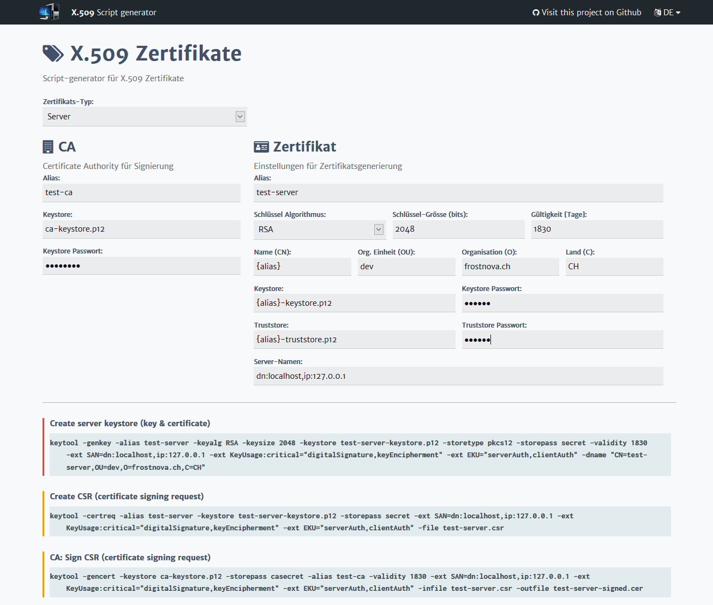

# X.509 certificate script generator

Angular UI to ease generation of X.509 certificates using the Java keytool.

You can **try it out** here: http://frostnova.ch/cert

## Build / Bundle with Maven
The project contains a **Maven** POM, allowing it to be built using the `maven-frontend-plugin` (which does not require Node or Gulp to be pre-installed on the system). This POM can be used as a template for Java/Angular web projects, and bundles the application as a WAR file in the target folder.
Usage:

    mvn
	
## Build / Bundle with Gradle
The project contains a **Gradle** build descriptor, which (same as the Maven build) bundles the application as a WAR file.
Usage:

    gradle
    
## Build / Bundle with NPM
You can also directly build this project using **NPM**

Usage:

    npm build
    
To start a local test server with auto-reload (for local development):

    npm start

## Notes

 - For keeping the Node modules/dependencies up-to-date, use [npm-check-updates](https://www.npmjs.com/package/npm-check-updates)
